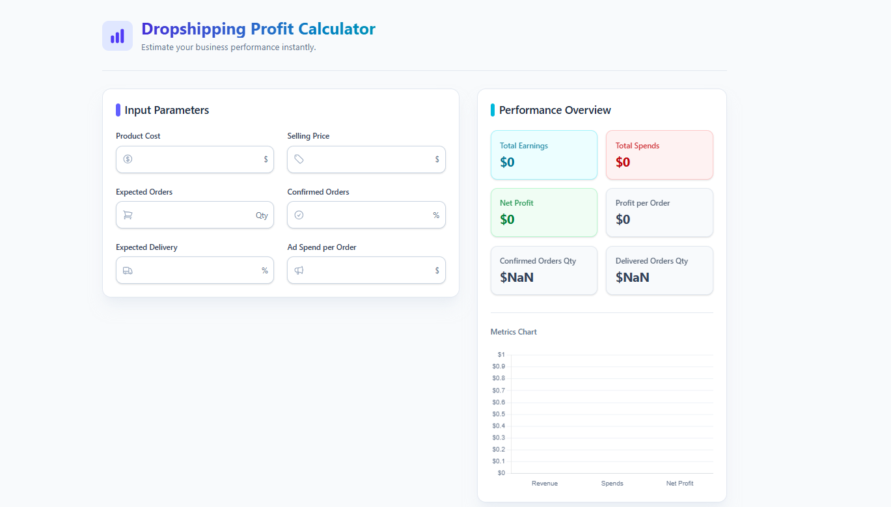

# Dropshipping Profit Calculator 💰📊

A modern, responsive, and dynamic web application built with React to help dropshippers calculate and visualize their true Net Margins based on real-world variables like expected order count, delivery rates, and ad spends.

 

[**Explore the Repository**](https://github.com/CodeByTinku/Dropshipping-Profit-Calculator)

---

## 🔥 Key Features

- **Dynamic Data Context:** Built seamlessly with React Context API. All calculations auto-update instantly without lag.
- **Visual Analytics:** Fully integrated **Chart.js** bar-graph visualizing Gross Revenue vs. Total Spends vs. Net Profit.
- **Accurate Logistics Calculations:** Factors in Expected Delivery % and Confirmed Order %—because the true dropshipping profit lies in successful *deliveries*, not just click-throughs!
- **Smooth Aesthetics:** Implemented using **Tailwind CSS v4** featuring a vibrant and clean 'Light Theme' alongside fluid **Framer Motion** numbers animations.
- **Easy Form Handling:** Integrated with `@heroicons/react` for intuitive iconography inside input bars.

---

## 🛠️ Tech Stack

- **Frontend Framework**: [React](https://reactjs.org/) (via [Vite](https://vitejs.dev/))
- **Styling**: [Tailwind CSS v4](https://tailwindcss.com/)
- **Charts**: [Chart.js](https://www.chartjs.org/) + `react-chartjs-2`
- **Animations**: [Framer Motion](https://www.framer.com/motion/)
- **Icons**: [Heroicons](https://heroicons.com/)

---
## Screenshot



🚀 Demo You can try this **Profit-Calculator** live here: [](https://dropshipping-profit-calculator.vercel.app/)

If you wish to run the Dropshipping Profit Calculator on your local environment, follow these steps:

**1. Clone the repository**
```bash
git clone https://github.com/CodeByTinku/Dropshipping-Profit-Calculator.git
cd Dropshipping-Profit-Calculator
```

**2. Install Dependencies**
```bash
npm install
```

**3. Run the Development Server**
```bash
npm run dev
```

The app will be available at `http://localhost:5173/`. 

---

## 💡 How It Works

The calculator relies on actual logistic metrics typical to Indian & Worldwide Dropshipping setups:

1. **Calculate Delivered Orders:** `Expected Orders` × `(Confirmed Orders % / 100)` × `(Expected Delivery % / 100)`.
2. **Revenue Calculation:** Total `Revenue` is strictly computed against successfully Delivered Orders.
3. **Ad Spend & Spends:** Deductions account for Ad Costs made per *shipped / expected* order, providing a brutally honest Net Profit projection.

---

**Happy Dropshipping! 📈🚀**
